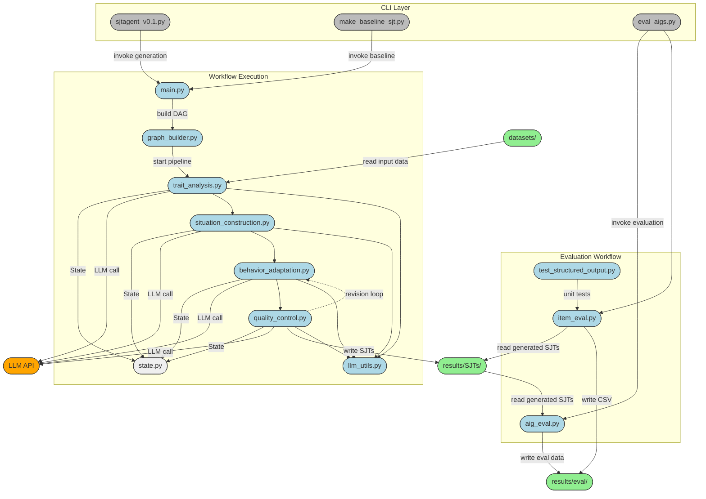

# SJTAgent

基于LLM的情境判断测验(SJT)自动生成系统，用于生成个性化的人格评估题目。

## 项目简介

SJTAgent是一个使用大语言模型(LLM)自动生成个人情境判断测验(Personal Situation Judgment Test, PSJT)的智能系统。该项目通过多阶段工作流程，将传统的自评量表题目转换为更加真实有效的情境化评估题目。

### 核心特性

- **多阶段工作流**: 包括特质分析、情境构建、行为适应、质量控制等步骤
- **自动化生成**: 基于Big Five人格特质理论，自动生成高质量的情境判断题目
- **质量评估**: 内置评估模块，确保生成题目的有效性和一致性
- **多语言支持**: 支持中文和英文题目生成


## 项目结构



## 快速开始

1. 安装依赖：
```bash
pip install -r requirements.txt
```

2. 使用当前v0.1 工作流版本：
sjtagent_v0.1.py


3. 使用生成题目质量评估：
eval_aigs.py

## TODO

### sjtagent_v0.1 待完成任务
- [ ] 优化生成算法，使其能够产生符合eval模块评估标准的高质量测验题目
- [ ] 完善质量控制机制，提高题目的心理测量学指标
- [ ] 增强评估模块的准确性和全面性

### sjtagent_v0.2 计划功能
- [ ] **ReAct功能**: 实现推理-行动(Reasoning-Acting)循环，提升生成过程的自适应能力
- [ ] **GroupDiscuss功能**: 引入多智能体讨论机制，通过群体协作提升题目质量
- [ ] **高级工作流**: 支持更复杂的生成策略和优化算法
- [ ] **批量生成**: 支持大规模题目批量生成和管理
- [ ] **自定义特质**: 支持用户定义的个性特质和评估维度


## 贡献

欢迎小伙伴们提交Issue和Pull Request来推进项目。

### v0.1工作流


### item评估

